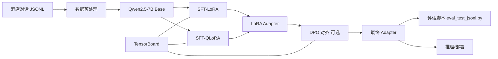

# 🏨 End-to-End Distributed Fine-Tuning of Qwen2.5-7B for Hotel Intelligence

<p align="left">
  
  
  
  
  
  
  
</p>

<p>
  <a href="#-8-dpo-实验量化2-gpu"></a>
  <a href="#-13-dpo-全量日志总表原始指标整理"></a>
  <a href="#-5-项目目录导航可点击"></a>
</p>

<p align="center">
  
</p>

## 📌 目录（Clickable TOC）
> 面向 AI 工程师作品集展示：强调 **可复现**、**可观测**、**可扩展**。🚀
- [🎯 1. 项目简介](#-1-项目简介project-overview)
- [⭐ 2. 项目特点](#-2-项目特点features)
- [🏗️ 3. 技术架构](#-3-技术架构architecture)
- [🧠 4. 微调方法](#-4-微调方法介绍sft--lora--qlora--dpo)
- [🗂️ 5. 项目目录导航](#-5-项目目录导航可点击)
- [⚙️ 6. 环境配置](#-6-环境配置)
- [🧾 7. 训练数据格式](#-7-训练数据格式示例实用)
- [🧪 8. DPO 实验量化](#-8-dpo-实验量化2-gpu)
- [🖼️ 9. DPO 效果图](#-9-dpo-实验效果图)
- [🔍 10. 推理与评估](#-10-推理与评估示例)
- [💡 11. 技术亮点](#-11-技术亮点)
- [🛠️ 12. 常见问题](#-12-常见问题高频排障)
- [📊 13. DPO 全量日志总表](#-13-dpo-全量日志总表原始指标整理)

---

## 🎯 1. 项目简介（Project Overview）

本项目围绕 `Qwen2.5-7B-Instruct` 构建酒店领域微调系统，覆盖：

- `SFT-LoRA`：低风险建立可用基线
- `SFT-QLoRA`：低显存条件下训练 7B 模型
- `DPO`：基于偏好对提升回答质量

项目目标不是“写论文理论”，而是提供一套**AI 工程可落地方案**：

- 双卡分布式训练可直接跑
- 训练日志可追踪（TensorBoard）
- 常见问题有现成排障策略
- 输出可用于简历/面试展示

---

## ⭐ 2. 项目特点（Features）

- **分布式训练开箱即用**：`torchrun` 双卡脚本已配置。
- **稳定优先策略**：默认 DDP，支持 `USE_DEEPSPEED=1` 切 ZeRO2。
- **方法链路完整**：`SFT -> DPO` 两阶段能力对齐。
- **可观测训练**：`--report_to tensorboard` 与事件文件输出已接通。
- **数据工程友好**：支持从 SFT 自动构建弱偏好 DPO 数据。
- **脚本化交付**：核心训练/评测全部有可复制命令。

> 工程视角关键点：

- 训练与评估解耦：`qwen2/train_*.sh` + `qwen2/eval_test_jsonl.py`
- 模型增量参数化：仅持久化 adapter，便于版本管理
- 可逐阶段迭代：先 SFT，再 DPO，不强耦合


### 📊 Performance

#### Model Information

| Item | Value |
|-----|-----|
| Base Model | Qwen2.5-7B-Instruct |
| Fine-tuned Checkpoint | checkpoint-2150 |
| Dataset | `test.jsonl` |
| Total Samples | **560 Long Dialogue** |
| Search Samples | **242 search 🔍** |
| Assistant Samples | **318 assistant 🤖** |

---

#### 🚀 Overall Performance

| Metric | Score |
|------|------|
| Role Accuracy | **🙆 99.11%** |
| Slot Precision | **95.96%** |
| Slot Recall | **95.50%** |
| Slot F1 | **✅ 95.73%** |
| Slot Exact Match | **90.08%** |
| BLEU-4 | **44.51** |
| ROUGE-L F1 | **60.40** |

---

### 📈 Metric Definitions

| Metric | Description |
|------|------|
| Role Accuracy | Accuracy of predicted role (`search` / `assistant`) |
| Slot Precision | Precision of predicted slots (search tasks) |
| Slot Recall | Recall of predicted slots (search tasks) |
| Slot F1 | F1 score of predicted slot values |
| Slot Exact Match | Exact match rate of predicted argument dictionaries |
| BLEU-4 | Character-level BLEU score for assistant responses |
| ROUGE-L F1 | Character-level ROUGE-L F1 score for assistant responses |

---

### 💬 Example Case

#### Multi-turn Dialogue Scenario

User interacts with the system to search for hotels and finally confirms a booking.

---

#### Conversation Context

```text
User: 恩，那好吧，再帮我找一个评分4分以上的酒店，在什么地方都行。

System → search:
{
  "rating_range_lower": 4.0
}

Return Result:
北京贵都大酒店 (评分 4.7)

Assistant:
北京贵都大酒店是个不错的选择。

User: 好的，最后帮我找一个酒店，要4.5分以上的，酒店有吹风机就好。

System → search:
{
  "facilities": ["吹风机"],
  "rating_range_lower": 4.5
}

Return Result:
北京富力万丽酒店 (评分 4.7)

Assistant:
北京富力万丽酒店呗！

User:
好的，我决定入住北京富力万丽酒店了！

---

## 🏗️ 3. 技术架构（Architecture）




---

## 🧠 4. 微调方法介绍（SFT / LoRA / QLoRA / DPO）

| 方法 | 工程目标 | 资源成本 | 适用阶段 | 当前脚本 |
|---|---|---:|---|---|
| LoRA（基础） | 参数高效微调 | 中 | SFT 基础能力学习 | `train.sh` |
| SFT-LoRA | 快速建立可用基线 | 中 | 第一步推荐 | `train_sft_lora_2gpu.sh` |
| SFT-QLoRA | 降显存、保效果 | 低 | 显存受限优先 | `train_sft_qlora_2gpu.sh` |
| DPO | 偏好对齐、提升主观质量 | 中高 | 第二阶段增强 | `train_dpo_2gpu.sh` |

### 4.1 四个核心命令（直接可用）

```bash
bash /root/autodl-tmp/fineTuningLab/qwen2/train.sh
bash /root/autodl-tmp/fineTuningLab/qwen2/train_sft_lora_2gpu.sh
bash /root/autodl-tmp/fineTuningLab/qwen2/train_sft_qlora_2gpu.sh
bash /root/autodl-tmp/fineTuningLab/qwen2/train_dpo_2gpu.sh
```

### 4.2 推荐落地路线

1. `SFT-LoRA` 跑通基线
2. 根据显存切换到 `SFT-QLoRA`
3. 有偏好数据时再做 `DPO`

---

## 🗂️ 5. 项目目录导航（可点击）

### 5.1 核心文件快速跳转

| 模块 | 路径 | 说明 |
|---|---|---|
| 主文档 | [`README.md`](README.md) | 项目总览与实验结果 |
| 依赖 | [`requirements.txt`](requirements.txt) | Python 依赖列表 |
| SFT 训练 | [`qwen2/train.sh`](qwen2/train.sh) | LoRA 基础训练入口 |
| 双卡 SFT-LoRA | [`qwen2/train_sft_lora_2gpu.sh`](qwen2/train_sft_lora_2gpu.sh) | 2GPU 稳定基线 |
| 双卡 SFT-QLoRA | [`qwen2/train_sft_qlora_2gpu.sh`](qwen2/train_sft_qlora_2gpu.sh) | 低显存 2GPU 训练 |
| 双卡 DPO | [`qwen2/train_dpo_2gpu.sh`](qwen2/train_dpo_2gpu.sh) | 偏好对齐训练 |
| DPO 主程序 | [`qwen2/dpo_train.py`](qwen2/dpo_train.py) | DPOConfig / Trainer |
| 推理评估 | [`qwen2/eval_test_jsonl.py`](qwen2/eval_test_jsonl.py) | 输出 metrics + predictions |
| DPO 数据构建 | [`qwen2/build_dpo_from_sft.py`](qwen2/build_dpo_from_sft.py) | SFT -> DPO 样本构建 |
| 数据目录 | [`data/`](data/) | `train/dev/test` 与 DPO 数据 |
| 实验图片 | [`assets/2gpuDPO/`](assets/2gpuDPO/) | 显存与 TensorBoard 图 |

### 5.2 目录结构（Overview）

```text
fineTuningLab/
├── README.md
├── requirements.txt
├── data/
│   ├── train.jsonl
│   ├── dev.jsonl
│   ├── test.jsonl
│   ├── dpo_train.jsonl
│   └── dpo_dev.jsonl
└── qwen2/
    ├── finetune.py
    ├── dpo_train.py
    ├── eval_test_jsonl.py
    ├── build_dpo_from_sft.py
    ├── train.sh
    ├── train_sft_lora_2gpu.sh
    ├── train_sft_qlora_2gpu.sh
    └── train_dpo_2gpu.sh
```

---

## ⚙️ 6. 环境配置

### 6.1 依赖安装

```bash
cd /root/autodl-tmp/fineTuningLab
pip install -r requirements.txt
```

### 6.2 GPU 检查（建议）

```bash
nvidia-smi
python -c "import torch; print(torch.cuda.device_count())"
```

### 6.3 TensorBoard 一键启动

```bash
cd /root/autodl-tmp/fineTuningLab/qwen2 && python -m pip install -q tensorboard && nohup tensorboard --logdir output --host 0.0.0.0 --port 6006 > output/tensorboard.log 2>&1 &
```

```bash
tail -n 30 /root/autodl-tmp/fineTuningLab/qwen2/output/tensorboard.log
find /root/autodl-tmp/fineTuningLab/qwen2/output -name "events.out.tfevents*"
```

---

## 🧾 7. 训练数据格式示例（实用）

### SFT JSONL

```json
{
  "context": "[{\"role\":\"user\",\"content\":\"推荐一家有无烟房的酒店\"}]",
  "response": "{\"role\":\"search\",\"arguments\":{\"facilities\":[\"无烟房\"]}}"
}
```

### DPO JSONL

```json
{
  "prompt": "<|im_start|>user\n推荐一家酒店<|im_end|>",
  "chosen": "推荐您选择北京某酒店，位置便利且口碑较好。",
  "rejected": "不知道。"
}
```

---

## 🧪 8. DPO 实验量化（2 GPU）

### 8.1 关键阶段指标（你本次日志）

| 阶段 | Epoch | Loss | Grad Norm | Reward Accuracy | Reward Margin |
|---|---:|---:|---:|---:|---:|
| 初期 | `0.23` | `0.6944` | `6.4679` | `0.4438` | `-0.0042` |
| 中期 | `0.92` | `0.5945` | `5.8041` | `0.9500` | `0.2151` |
| 后期 | `1.84` | `0.2282` | `2.4730` | `1.0000` | `1.5056` |
| Eval | `1.15` | `0.4739` | `-` | `1.0000` | `0.5121` |
| Train Summary | `2.00` | `0.4844` | `-` | `-` | `-` |

**结论**：DPO 训练稳定收敛，`loss` 持续下降、`reward margin` 持续增大，`reward accuracy` 达到 `1.0`。✅

### 8.2 总表跳转按钮（点击查看全量日志）

<p>
  <a href="#-13-dpo-全量日志总表原始指标整理"></a>
</p>

---

## 🖼️ 9. DPO 实验效果图

> 按你的要求展示：`memory.png` + `tfboard1.png` + `tfboard1.png`

### 📊 DPO Training Metrics (TensorBoard)

<p align="center">
  
</p>

<p align="center"><em>Figure 1. Key DPO training metrics visualized in TensorBoard.</em></p>


<p align="center">
  
</p>

<p align="center"><em>Figure 2. Additional DPO optimization indicators during training.</em></p>


### 🖥️ GPU Memory Usage

<p align="center">
  
</p>

<p align="center"><em>Figure 3. GPU memory utilization during distributed training with 2 GPUs.</em></p>


---

## 🔍 10. 推理与评估示例

```bash
cd /root/autodl-tmp/fineTuningLab/qwen2
python eval_test_jsonl.py \
  --model /root/autodl-tmp/Qwen2.5-7B-Instruct \
  --ckpt /root/autodl-tmp/fineTuningLab/qwen2/output/hotel_qwen2-20260307-190000 \
  --data ../data/test.jsonl \
  --device cuda:0
```

输出：

- `output/eval-metrics-*.json`
- `output/eval-predictions-*.jsonl`

---

## 📈 结果展示（示例）

| 任务 | 指标 | 示例值 |
|---|---|---:|
| 检索参数抽取 | `slot_f1` | `100.0` |
| 检索参数抽取 | `slot_exact_match` | `100.0` |
| 对话生成 | `BLEU-4` | `41.2113` |
| 对话生成 | `ROUGE-L F1` | `54.9674` |

---

## 💡 11. 技术亮点

- **工程化训练链路**：从数据到训练到评估，全流程脚本化。
- **分布式稳定性治理**：DDP 默认稳定、ZeRO2 可切换、NCCL 问题有预案。
- **多策略微调能力**：同一项目中落地 `LoRA / QLoRA / DPO`。
- **可观测性完备**：TensorBoard 日志、指标、事件文件全可追踪。
- **简历可量化表达**：有真实命令、真实指标、真实排障方案，不空泛。

---

## 🛠️ 12. 常见问题（高频排障）


- **OOM**：降低 `per_device_train_batch_size`，缩短 `max_length`，提高 `gradient_accumulation_steps`。
- **DPO NaN**：检查输入梯度设置、提高 `min_response_tokens`、降低学习率并加 warmup。
- **NCCL 非法访存**：先走默认稳定 DDP，再尝试 `USE_DEEPSPEED=1`。


---

## 📊 13. DPO 全量日志总表（原始指标整理）

| # | Epoch | Type | Loss | Grad Norm | LR | rewards/chosen | rewards/rejected | rewards/accuracies | rewards/margins |
|---:|---:|---|---:|---:|---:|---:|---:|---:|---:|
| 1 | 0.23 | Train | 0.6944 | 6.4679 | 8e-07 | 0.0043 | 0.0084 | 0.4437 | -0.0042 |
| 2 | 0.46 | Train | 0.6801 | 6.8886 | 8e-07 | 0.0046 | -0.0282 | 0.6062 | 0.0328 |
| 3 | 0.69 | Train | 0.6423 | 6.3661 | 8e-07 | 0.0128 | -0.0876 | 0.8250 | 0.1004 |
| 4 | 0.92 | Train | 0.5945 | 5.8041 | 8e-07 | 0.0426 | -0.1725 | 0.9500 | 0.2151 |
| 5 | 1.15 | Train | 0.5207 | 5.3681 | 8e-07 | 0.0403 | -0.3378 | 1.0000 | 0.3781 |
| 6 | 1.15 | Eval | 0.4739 | - | - | 0.0300 | -0.4821 | 1.0000 | 0.5121 |
| 7 | 1.38 | Train | 0.4120 | 4.7396 | 8e-07 | 0.0724 | -0.6340 | 1.0000 | 0.7064 |
| 8 | 1.61 | Train | 0.3348 | 3.9211 | 8e-07 | 0.0858 | -0.8868 | 1.0000 | 0.9726 |
| 9 | 1.84 | Train | 0.2282 | 2.4730 | 8e-07 | 0.0796 | -1.4260 | 1.0000 | 1.5056 |
| 10 | 2.00 | Train Summary | 0.4844 | - | - | - | - | - | - |

补充训练汇总：`train_runtime=1556.6895s`, `train_samples_per_second=1.791`, `train_steps_per_second=0.112`。
