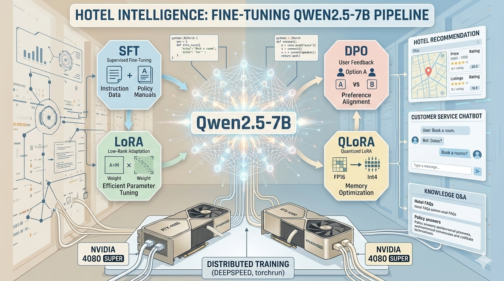
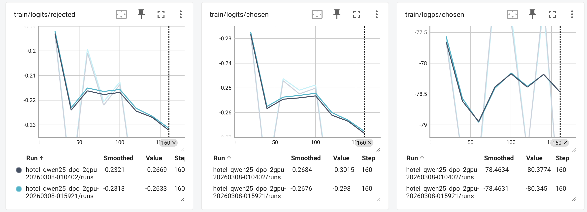
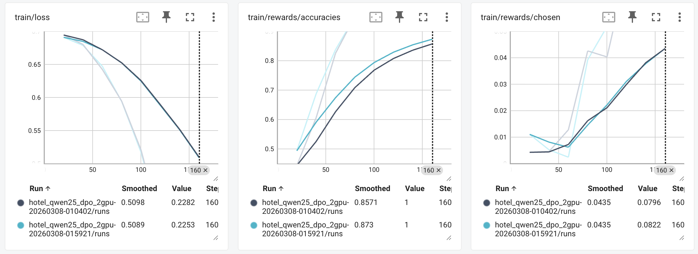
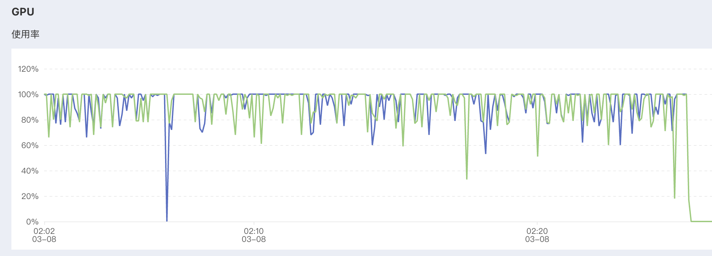
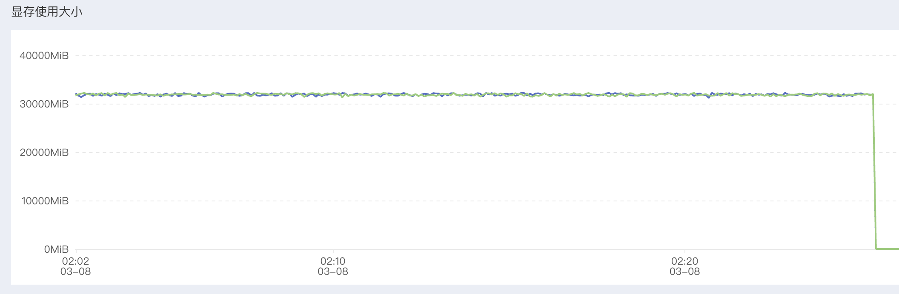

# 🏨 End-to-End Distributed Fine-Tuning of Qwen2.5-7B for Hotel Intelligence (SFT + LoRA + QLoRA + DPO)

<p align="left">
  
  
  
  
  
  
  
</p>

<p align="center">
  
</p>

> 面向 AI 工程师作品集展示：强调 **可复现**、**可观测**、**可扩展**。🚀


## 📌 目录（Clickable TOC）
- [🎯 1. 项目简介](#-1-项目简介project-overview)
- [📊 2. 模型评估面板](#-2-model-evaluation-dashboard)
- [💬 3. 示例对话](#-3--example-case)
- [🏗️ 4. 技术架构](#-4-技术架构architecture)
- [🧠 5. 微调方法](#-5-微调方法介绍sft--lora--qlora--dpo)
- [🗂️ 6. 项目目录导航](#-6-项目目录导航可点击)
- [⚙️ 7. 环境配置](#-7-环境配置)
- [🧾 8. 训练数据格式](#-8-训练数据格式示例实用)
- [🔍 9. 推理与评估](#-9-推理与评估示例)
- [💡 10. 技术亮点](#-10-技术亮点)
- [🛠️ 11. 常见问题](#-11-常见问题高频排障)
- [📊 Additional: DPO 全量日志总表](#-12-dpo-全量日志总表原始指标整理)

---

## 🎯 1. 项目简介（Project Overview）

> **1.1 项目内容: 本项目围绕 `Qwen2.5-7B-Instruct` 构建酒店领域微调系统，覆盖：**


- `SFT-LoRA`：低风险建立可用基线
- `SFT-QLoRA`：低显存条件下训练 7B 模型
- `DPO`：基于偏好对提升回答质量

提供一套**AI 工程可落地方案**：

- `双卡分布式训练`可直接跑
- 训练日志可追踪（TensorBoard）
- 常见问题有现成排障策略
- 输出可用于简历/面试展示

> **1.2 项目特点（Features）**


- **分布式训练开箱即用**：`torchrun` 双卡脚本已配置。
- **稳定优先策略**：默认 DDP，支持 `USE_DEEPSPEED=1` 切 ZeRO2。
- **方法链路完整**：`SFT -> DPO` 两阶段能力对齐。
- **可观测训练**：`--report_to tensorboard` 与事件文件输出已接通。
- **数据工程友好**：支持从 SFT 自动构建弱偏好 DPO 数据。
- **脚本化交付**：核心训练/评测全部有可复制命令。

> **1.3 工程视角关键点：**

- 训练与评估解耦：`qwen2/train_*.sh` + `qwen2/eval_test_jsonl.py`
- 模型增量参数化：仅持久化 adapter，便于版本管理
- 可逐阶段迭代：先 SFT，再 DPO，不强耦合


## 📊 2. Model Evaluation Dashboard 
> SFT-LoRA/QLoRA + DPO 训练指标全览，包含训练阶段指标表格、TensorBoard 可视化截图、GPU 内存使用图等，全面展示模型训练过程中的关键性能指标和资源利用情况。> DPO


### 1️⃣ 2.1 SFT-LoRA 训练指标（x2 RTX 4080 Super）

### 2.1.1 SFT-LoRA 训练阶段
| 阶段 | Epoch | Loss | Grad Norm | Reward Accuracy | Reward Margin |
|-----|------|------|-----------|----------------|---------------|
| 初期 | 0.25 | 0.3056 | 1.3281 | - | - |
| 中期 | 1.70 | 0.2424 | 3.0313 | - | - |
| 后期 | 1.92 | 0.1886 ⬇️ | 0.9063 | - | - |
| Eval | 1.84 | 0.1830 ⬇️ | - | - | - |

**结论：**  
2GPU Base + LoRA 微调过程中，**Loss 从 2.1109 快速下降至约 0.18–0.24 区间并保持稳定**，Grad Norm 整体可控，训练过程表现出 **良好的收敛性与稳定性**✅


### 2.1.2 SFT-LoRA 训练配置 + 量化评估
| 🏷 Category | 📌 Metric | 📈 Score | Definition |
|---|---|---|---|
| 🤖 **Model** | Base Model | **Qwen2.5-7B-Instruct** | <details><summary>⚪ Model</summary>Pretrained base model used before fine-tuning.</details> |
|  | Fine-tuned Checkpoint | **checkpoint-2150** | <details><summary>⚪ Checkpoint</summary>Training checkpoint selected for final evaluation.</details> |
| 📂 **Dataset** | Dataset | `data/test.jsonl` | <details><summary>⚪ Dataset</summary>Evaluation dataset containing long dialogue samples.</details> |
|  | Total Samples | **560 Long Dialogue🧾** | <details><summary>⚪ Total Samples</summary>Total number of multi-turn dialogue samples used for evaluation.</details> |
|  | Search Samples | **242 🔍** | <details><summary>⚪ Search Samples</summary>Samples requiring tool/search task prediction.</details> |
|  | Assistant Samples | **318 🤖** | <details><summary>⚪ Assistant Samples</summary>Samples requiring direct assistant responses.</details> |
| 🚀 **Core Metrics** | 🎯 **Role Accuracy** | **🙆 99.11%** | <details><summary>🔵 Role Accuracy</summary>Accuracy of predicted role (`search` / `assistant`).</details> |
|  | 🧩 **Slot F1** | **⭐ 95.73%** | <details><summary>🟢 Slot F1</summary>Harmonic mean of slot precision and recall measuring overall slot extraction performance.</details> |
| ⚙️ **Slot Metrics** | 🎯 Slot Precision | **95.96%** | <details><summary>⚪ Slot Precision</summary>Precision of predicted slots for search tasks.</details> |
|  | 🔎 Slot Recall | **95.50%** | <details><summary>⚪ Slot Recall</summary>Recall of predicted slots for search tasks.</details> |
|  | 📦 Slot Exact Match | **90.08%** | <details><summary>🟣 Slot Exact Match</summary>Percentage of predictions where the slot dictionary exactly matches the ground truth.</details> |
| 💬 **Generation Metrics** | 📝 BLEU-4 | **44.51** | <details><summary>🟡 BLEU-4</summary>Character-level BLEU score evaluating assistant response quality.</details> |
|  | 📚 ROUGE-L F1 | **60.40** | <details><summary>🟠</summary>Character-level ROUGE-L F1 score measuring overlap with reference responses.</details> |

---

### 🧠 Key Highlights

- 🎯 **Role Classification nearly perfect:** **99.11% Accuracy**
- 🧩 **Slot Extraction highly reliable:** **95.73% F1**
- 📦 **Exact Argument Matching:** **90.08%**
- 💬 **High-quality responses:** **BLEU-4 44.51 / ROUGE-L 60.40**

✅ **Overall**, the fine-tuned **Qwen2.5-7B-Instruct** demonstrates **excellent performance in dialogue role prediction, slot extraction, and assistant response generation**.


---

### 2️⃣ 2.3 DPO 训练指标（x2 RTX 4080 Super）

#### 📊 2.3.1 Training DPO Table


<p>
  <a href="#-12-dpo-全量日志总表原始指标整理"></a>
</p>

| 阶段 | Epoch | Loss | Grad Norm | Reward Accuracy | Reward Margin |
|---|---:|---:|---:|---:|---:|
| 初期 | 0.23 | `0.6944` | **6.4679** | 0.4438 | -0.0042 |
| 中期 | 0.92 | 0.5945 | 5.8041 | **0.9500** | 0.2151 |
| 后期 | 1.84 | `0.2282` | **2.4730** | **1.0000** | **1.5056** |
| Eval | 1.15 | `0.4739` | - | `1.0000` | 0.5121 |
| Train Summary | 2.00 | 0.4844 | - | - | - |

**结论**：  
DPO 训练过程 **稳定收敛**，`Loss` 从 **0.69 → 0.23** 持续下降，同时 **Reward Margin 持续增大**，最终 **Reward Accuracy 达到 1.0**，说明模型在偏好优化任务上学习效果显著。✅

#### 📊 2.3.2 TensorBoard Training Metrics

> 训练过程中，TensorBoard 监控的核心指标（Loss、Grad Norm、Reward Accuracy、Reward Margin）均表现出 **稳定下降的 Loss** 和 **持续提升的 Reward Accuracy/Margin**，验证了 DPO 训练的有效性和稳定性。

<p align="center">
  
</p>

<p align="center">
<em>Figure 1 · Core DPO training metrics visualized in TensorBoard, including loss dynamics and optimization signals.</em>
</p>

<br>

<p align="center">
  
</p>

<p align="center">
<em>Figure 2 · Additional optimization indicators observed during the DPO training process.</em>
</p>

---

#### 2.3.3 🖥️ GPU Memory Usage (2× GPU Training)

> 在分布式 DPO 训练过程中，GPU 内存使用情况保持在合理范围内，未出现 OOM 错误，验证了训练配置的稳定性和资源利用效率。
<p align="center">
  
</p>
<p align="center">
<em>Figure 3 · GPU (*2 RTX 4080 Super) Usage during distributed DPO training with 2 GPUs.</em>
</p>

<p align="center">
  
</p>

<p align="center">
<em>Figure 4 · GPU (*2 RTX 4080 Super) memory utilization during distributed DPO training with 2 GPUs.</em>
</p>


---

## 3. 💬 Example Case

#### 🎺 Multi-turn Dialogue Scenario

User interacts with the system to search for hotels and finally confirms a booking.

```python
# Round 1
🧑 User: 恩，那好吧，再帮我找一个评分4分以上的酒店，在什么地方都行。

🤖 System → search:
{
  "rating_range_lower": 4.0
}

Return Result:
北京贵都大酒店 (评分 4.7)

Assistant:
北京贵都大酒店是个不错的选择。

# Round 2
🧑 User: 好的，最后帮我找一个酒店，要4.5分以上的，酒店有吹风机就好。

🤖 System → search:
{
  "facilities": ["吹风机"],
  "rating_range_lower": 4.5
}

Return Result:
北京富力万丽酒店 (评分 4.7)

Assistant:
北京富力万丽酒店呗！

# End
🧑 User:
好的，我决定入住北京富力万丽酒店了！
```

---

## 🏗️ 4. 技术架构（Architecture）


```mermaid
flowchart TD
  %% 1️⃣ 数据来源: 
  A[🦎原始酒店对话数据 JSONL] --> B[数据预处理 & 清洗] --> C[Qwen2.5-7B Base Model]

  %% 微调路径
  C --> D1[SFT-LoRA 微调] (模型进行监督学习微调, 标准 FP16 或 BF16)
  C --> D2[SFT-QLoRA 微调] (针对大模型（7B）的低显存训练。使用 4-bit 量化 + LoRA, 低位量化 + Adapter，适合显存受限环境)

  %% 2️⃣ Adapter 层 (训练完成后生成的权重模块。LoRA 和 QLoRA 训练的结果都是 Adapter 权重，不修改主模型)
  D1 --> E[LoRA Adapter]
  D2 --> E[QLoRA Adapter]

  %% 3️⃣ 偏好优化
  E --> F[DPO 对齐 (Optional) (通过 人类偏好对数据（human preference pair）进一步优化模型输出，提升主观质量和用户满意度。DPO 训练后生成新的 Adapter 权重，质量和自然度提升明显)]
  F --> G[最终 Adapter] (最终的 Adapter 权重，包含了 SFT 和 DPO 的优化结果)

  %% 4️⃣ 下游应用
  G --> H[评估脚本 eval_test_jsonl.py]
  G --> I[推理/部署服务]

  %% 5️⃣ 训练监控
  subgraph 监控
    J[TensorBoard 可视化]
    J --- D1
    J --- D2
    J --- F
  end

  class A source;
  class B process;
  class C model;
  class D1,D2 process;
  class E,F,G adapter;
  class H,I evaluation;
  class J process;
```

| 阶段 | 描述 | 详细说明 |
|------|------|----------|
| 🦎 (1) 原始酒店对话数据 JSONL | 原始数据准备 | <details><summary>⚪ 查看</summary>- 格式化槽位（如酒店类型、设施、价格等）<br>- 可选：生成 SFT（Supervised Fine-Tuning）数据对，包括 prompt 和 response</details> |
| 🧹 (2) 数据预处理 & 清洗 | 数据清洗与格式化 | <details><summary>🟢 查看</summary>- 数据清洗与格式化<br>- 准备适合模型训练的输入输出对 (如 DPO 生成的 {receive, chosen, rejected} 样本)<br>- 支持 SFT 数据生成</details> |
| 🤖 (3) 基础模型 | Qwen2.5-7B Base Model | <details><summary>⚪ 查看</summary>- 提供语言理解与生成能力<br>- 作为微调基础</details> |
| 🎯 (4.1) SFT-LoRA 微调 | 监督微调模型 | <details><summary>🔵 查看</summary>- 使用监督学习微调模型<br>- 支持 FP16 / BF16<br>- 生成 LoRA Adapter 权重</details> |
| 🎯 (4.2) SFT-QLoRA 微调 | 低显存微调 | <details><summary>🔵 查看</summary>- 针对大模型（7B）低显存训练<br>- 使用 4-bit 量化 + LoRA Adapter<br>- 适合显存受限环境</details> |
| 🧩 (5) LoRA / QLoRA Adapter | 微调权重模块 | <details><summary>⚪ 查看</summary>- 微调后生成的权重模块<br>- 不修改主模型，只附加在基础模型上<br>- 包含 SFT 微调结果</details> |
| 🌟 (6) DPO 对齐 | 偏好优化 | <details><summary>⚪ 查看</summary>- 基于 human preference 对数据进一步优化模型输出<br>- 提升主观质量和用户满意度<br>- DPO 训练后生成新的 Adapter 权重<br>- 提升生成质量和自然度</details> |
| 🏁 (7) 最终 Adapter | 下游推理与部署 | <details><summary>🔵 查看</summary>- 包含 SFT 与 DPO 的优化结果<br>- 用于下游推理和部署</details> |

---

## 🧠 5. 微调方法介绍（SFT / LoRA / QLoRA / DPO）

| 方法 | 工程目标 | 资源成本 | 适用阶段 | 当前脚本 |
|---|---|---:|---|---|
| LoRA（基础） | 参数高效微调 | 中 | SFT 基础能力学习 | `train.sh` |
| SFT-LoRA | 快速建立可用基线 | 中 | 第一步推荐 | `train_sft_lora_2gpu.sh` |
| SFT-QLoRA | 降显存、保效果 | 低 | 显存受限优先 | `train_sft_qlora_2gpu.sh` |
| DPO | 偏好对齐、提升主观质量 | 中高 | 第二阶段增强 | `train_dpo_2gpu.sh` |

### 5.1 四个核心命令（直接可用）

```bash
bash /root/autodl-tmp/fineTuningLab/qwen2/train.sh
bash /root/autodl-tmp/fineTuningLab/qwen2/train_sft_lora_2gpu.sh
bash /root/autodl-tmp/fineTuningLab/qwen2/train_sft_qlora_2gpu.sh
bash /root/autodl-tmp/fineTuningLab/qwen2/train_dpo_2gpu.sh
```

### 5.2 推荐落地路线

1. `SFT-LoRA` 跑通基线
2. 根据显存切换到 `SFT-QLoRA`
3. 有偏好数据时再做 `DPO`

---

## 🗂️ 6. 项目目录导航（可点击）

### 6.1 核心文件快速跳转

| 模块 | 路径 | 说明 |
|---|---|---|
| 主文档 | [`README.md`](README.md) | 项目总览与实验结果 |
| 依赖 | [`requirements.txt`](requirements.txt) | Python 依赖列表 |
| SFT 训练 | [`qwen2/train.sh`](qwen2/train.sh) | LoRA 基础训练入口 |
| 双卡 SFT-LoRA | [`qwen2/train_sft_lora_2gpu.sh`](qwen2/train_sft_lora_2gpu.sh) | 2GPU 稳定基线 |
| 双卡 SFT-QLoRA | [`qwen2/train_sft_qlora_2gpu.sh`](qwen2/train_sft_qlora_2gpu.sh) | 低显存 2GPU 训练 |
| 双卡 DPO | [`qwen2/train_dpo_2gpu.sh`](qwen2/train_dpo_2gpu.sh) | 偏好对齐训练 |
| DPO 主程序 | [`qwen2/dpo_train.py`](qwen2/dpo_train.py) | DPOConfig / Trainer |
| 推理评估 | [`qwen2/eval_test_jsonl.py`](qwen2/eval_test_jsonl.py) | 输出 metrics + predictions |
| DPO 数据构建 | [`qwen2/build_dpo_from_sft.py`](qwen2/build_dpo_from_sft.py) | SFT -> DPO 样本构建 |
| 数据目录 | [`data/`](data/) | `train/dev/test` 与 DPO 数据 |
| 实验图片 | [`assets/2gpuDPO/`](assets/2gpuDPO/) | 显存与 TensorBoard 图 |

### 6.2 目录结构（Overview）

```text
fineTuningLab/
├── README.md
├── requirements.txt
├── data/
│   ├── train.jsonl
│   ├── dev.jsonl
│   ├── test.jsonl
│   ├── dpo_train.jsonl
│   └── dpo_dev.jsonl
└── qwen2/
    ├── finetune.py
    ├── dpo_train.py
    ├── eval_test_jsonl.py
    ├── build_dpo_from_sft.py
    ├── train.sh
    ├── train_sft_lora_2gpu.sh
    ├── train_sft_qlora_2gpu.sh
    └── train_dpo_2gpu.sh
```

---

## ⚙️ 7. 环境配置

### 7.1 依赖安装

```bash
cd /root/autodl-tmp/fineTuningLab
pip install -r requirements.txt
```

### 7.2 GPU 检查（建议）

```bash
nvidia-smi
python -c "import torch; print(torch.cuda.device_count())"
```

### 7.3 TensorBoard 一键启动

```bash
cd /root/autodl-tmp/fineTuningLab/qwen2 && python -m pip install -q tensorboard && nohup tensorboard --logdir output --host 0.0.0.0 --port 6006 > output/tensorboard.log 2>&1 &
```

```bash
tail -n 30 /root/autodl-tmp/fineTuningLab/qwen2/output/tensorboard.log
find /root/autodl-tmp/fineTuningLab/qwen2/output -name "events.out.tfevents*"
```

---

## 🧾 8. 训练数据格式示例（实用）

### SFT JSONL

```json
{
  "context": "[{\"role\":\"user\",\"content\":\"推荐一家有无烟房的酒店\"}]",
  "response": "{\"role\":\"search\",\"arguments\":{\"facilities\":[\"无烟房\"]}}"
}
```

### DPO JSONL

```json
{
  "prompt": "<|im_start|>user\n推荐一家酒店<|im_end|>",
  "chosen": "推荐您选择北京某酒店，位置便利且口碑较好。",
  "rejected": "不知道。"
}
```


---

## 🔍 9. 推理与评估示例

```bash
cd /root/autodl-tmp/fineTuningLab/qwen2
python eval_test_jsonl.py \
  --model /root/autodl-tmp/Qwen2.5-7B-Instruct \
  --ckpt /root/autodl-tmp/fineTuningLab/qwen2/output/hotel_qwen2-20260307-190000 \
  --data ../data/test.jsonl \
  --device cuda:0
```

输出：

- `output/eval-metrics-*.json`
- `output/eval-predictions-*.jsonl`


---

## 💡 10. 技术亮点

- **工程化训练链路**：从数据到训练到评估，全流程脚本化。
- **分布式稳定性治理**：DDP 默认稳定、ZeRO2 可切换、NCCL 问题有预案。
- **多策略微调能力**：同一项目中落地 `LoRA / QLoRA / DPO`。
- **可观测性完备**：TensorBoard 日志、指标、事件文件全可追踪。
- **简历可量化表达**：有真实命令、真实指标、真实排障方案，不空泛。

---

## 🛠️ 11. 常见问题（高频排障）


- **OOM**：降低 `per_device_train_batch_size`，缩短 `max_length`，提高 `gradient_accumulation_steps`。
- **DPO NaN**：检查输入梯度设置、提高 `min_response_tokens`、降低学习率并加 warmup。
- **NCCL 非法访存**：先走默认稳定 DDP，再尝试 `USE_DEEPSPEED=1`。


---

## 📊 12. DPO 全量日志总表（原始指标整理）

| # | Epoch | Type | Loss | Grad Norm | LR | rewards/chosen | rewards/rejected | rewards/accuracies | rewards/margins |
|---:|---:|---|---:|---:|---:|---:|---:|---:|---:|
| 1 | 0.23 | Train | 0.6944 | 6.4679 | 8e-07 | 0.0043 | 0.0084 | 0.4437 | -0.0042 |
| 2 | 0.46 | Train | 0.6801 | 6.8886 | 8e-07 | 0.0046 | -0.0282 | 0.6062 | 0.0328 |
| 3 | 0.69 | Train | 0.6423 | 6.3661 | 8e-07 | 0.0128 | -0.0876 | 0.8250 | 0.1004 |
| 4 | 0.92 | Train | 0.5945 | 5.8041 | 8e-07 | 0.0426 | -0.1725 | 0.9500 | 0.2151 |
| 5 | 1.15 | Train | 0.5207 | 5.3681 | 8e-07 | 0.0403 | -0.3378 | 1.0000 | 0.3781 |
| 6 | 1.15 | Eval | 0.4739 | - | - | 0.0300 | -0.4821 | 1.0000 | 0.5121 |
| 7 | 1.38 | Train | 0.4120 | 4.7396 | 8e-07 | 0.0724 | -0.6340 | 1.0000 | 0.7064 |
| 8 | 1.61 | Train | 0.3348 | 3.9211 | 8e-07 | 0.0858 | -0.8868 | 1.0000 | 0.9726 |
| 9 | 1.84 | Train | 0.2282 | 2.4730 | 8e-07 | 0.0796 | -1.4260 | 1.0000 | 1.5056 |
| 10 | 2.00 | Train Summary | 0.4844 | - | - | - | - | - | - |

补充训练汇总：`train_runtime=1556.6895s`, `train_samples_per_second=1.791`, `train_steps_per_second=0.112`。
